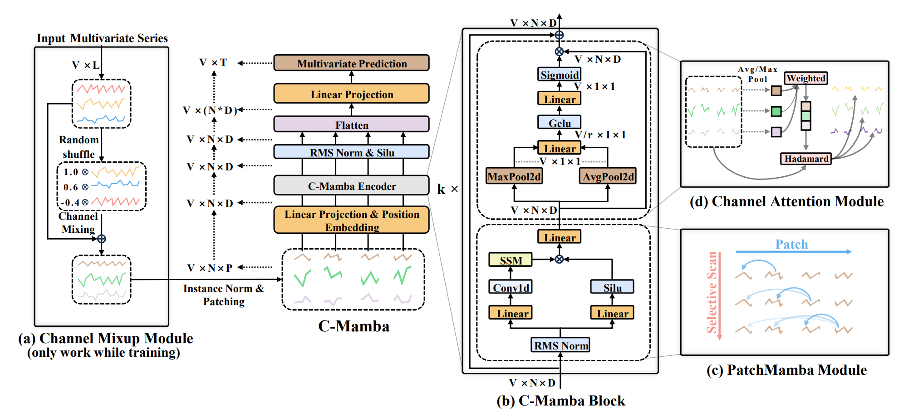
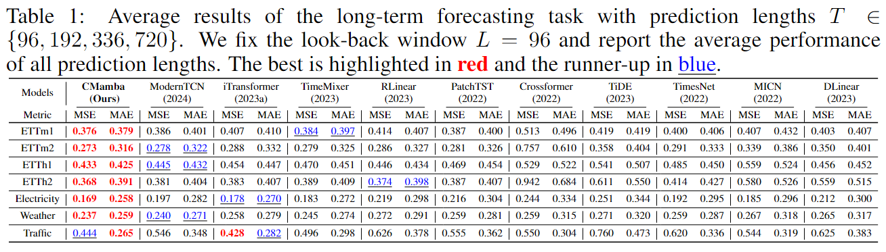

# CMamba: Channel Correlation Enhanced State Space Models for Multivariate Time Series Forecasting

In this repository, we present the code of "CMamba: Channel Correlation Enhanced State Space Models for Multivariate Time Series Forecasting".




## Updates

- **News** (2024.9.27) The updated arXiv paper has been available. [[arXiv]](https://arxiv.org/abs/2406.05316) [[Paper]](https://arxiv.org/pdf/2406.05316)
- **News** (2024.9.26) An updated version of our model has replaced the original one in this repository. The arXiv will also be updated soon.

## Data

All the datasets are available at [Autoformer: Google Drive](https://drive.google.com/drive/folders/1ZOYpTUa82_jCcxIdTmyr0LXQfvaM9vIy). You only need to download `electricity`, `ETT-small`, `traffic`, and `weather`.

## Environment

We implement our code in `Python 3.9` and `CUDA 11.7`. See [requirments.txt](./requirements.txt) for other packages. For convenience, you can install using the following commands:
```
pip install https://download.pytorch.org/whl/cu117_pypi_cudnn/torch-2.0.0%2Bcu117.with.pypi.cudnn-cp39-cp39-linux_x86_64.whl

pip install -r requirements.txt
```

## Reproducibility

All the training scripts are provided in [scripts/long_term_forecast](./scripts/long_term_forecast). For instance, if you want to get the results for the `weather` dataset, you just need to run:
```
bash ./scripts/long_term_forecast/Weather_script/CMamba.sh
``` 
The default `seq_len` in this repository is `96`. For other experimental settings, the hyperparameters that you can tune are:
```
--seq_len
--pred_len
--batch_size
--learning_rate
--e_layers        # the number of CMamba block
--dropout         # dropout in CMamba block
--head_dropout    # dropout before the final linear projection layer
--d_model         # dimension of patch embedding
--d_ff            # dimension of linear projection in Mamba
--sigma           # standard derivation for Channel Mixup
--reduction       # reduction rate (expansion rate in paper) for GDD-MLP
```
It is recommended to tune `e_layers` in {2, 3, 4, 5}, `d_model=d_ff` in {128, 256}, `sigma` in {0.1, 0.5, 1.0,..., 5.0}, and `reduction` in {2, 4, 8}.

We also provide the experimental scripts for Table 4, where we combine our proposed Channel Mixup and GDD-MLP modules with state-of-the-art models. You can run the following command to reproduce the results:

```
bash ./scripts/long_term_forecast/ECL_script/PatchTST.sh
```

For convenience, you can also run the following command to reproduce all the results:
```
bash ./all.sh
```

## Results

- Checkpoints for each model will be saved in `checkpoints/`;
- Training log will be saved in `log/`;
- Prediction for the testing set will be saved in `results/` (if needed);
- Visualization for the results of testing set will be saved in `test_results/`.

## Acknowledgement

We are grateful for the following github repositories that provide valuable datasets and code base:

https://github.com/thuml/Autoformer

https://github.com/zshicode/MambaStock

https://github.com/thuml/Time-Series-Library

https://github.com/yuqinie98/PatchTST

https://github.com/kwuking/TimeMixer

https://github.com/luodhhh/ModernTCN

https://github.com/ts-kim/RevIN
